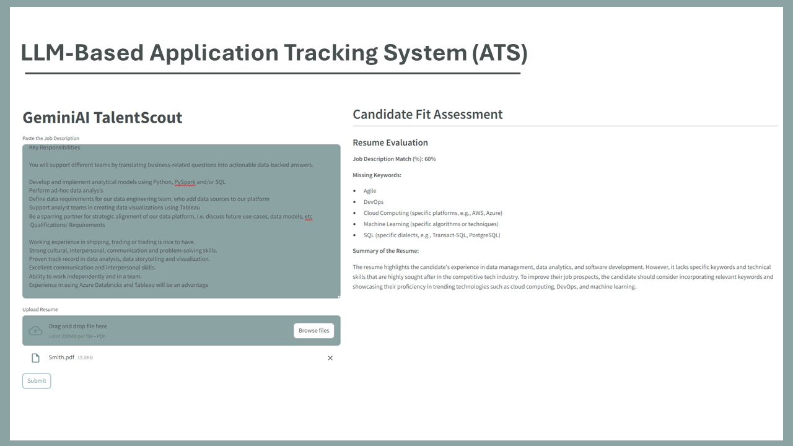

## GeminiAI TalentScout

The ATS (Application Tracking System) web application leverages the capabilities of a large language model to streamline and enhance the recruitment process. By integrating advanced natural language processing, the application aims to improve the efficiency and accuracy of managing job applications, from initial receipt to final decision. The system is designed to automate various tasks such as parsing resumes, matching candidate qualifications with job requirements, and providing insightful summaries and recommendations.

